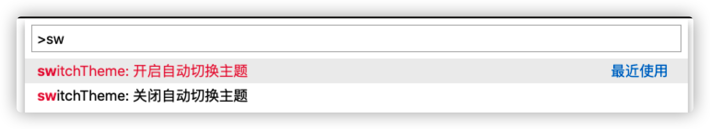

## **简介**

**在不同的时间段内应用不同的主题，通过设置对应的时间区间然后当前时间到达
该区间之后，自动应用该时间段内设置的Theme**

<br /><br />

### **配置表如下**

配置名称 | 用途 | 类型 | 默认值
---------|----------|---------|---------
 startTime | 设置起始时间 | string | 07:00
 defaultTheme | 设置当前时间没有匹配任何时间段时应用的主题 | string | Dark
 interval | 设置定时器的检查间隔(单位/S) | number | 1
 switchThemeOptions | 设置时间区间 | array | []

<br /><br />

### **默认配置**
```json
"switchTheme.startTime": "21:00",
"switchTheme.defaultTheme": "Dark",
"switchTheme.interval": 1,
"switchTheme.closeSwitch": false
"switchTheme.switchThemeOptions": []
```

### **switchThemeOptions**的详细配置
- useTheme 主题名称
- fromTime 距离起始时间(单位/M) , 例如当前设置的是50分钟，那么这个时间段就是(起始时间,起始时间+50分钟)
```json
"switchTheme.switchThemeOptions": [
  {
    "useTheme": "Plastic", 
    "fromTime": 50     
  },
  {
    "useTheme": "Github Light Theme",
    "fromTime": 120
  }
]
```

<br /><br />

### **相关命令**

**命令面板输入switchTheme然后在相应的配置中选择开关集成**



<br /><br />

### **效果图**


### **源码地址**

### [源码地址](https://github.com/GSZS/switch-thme)

